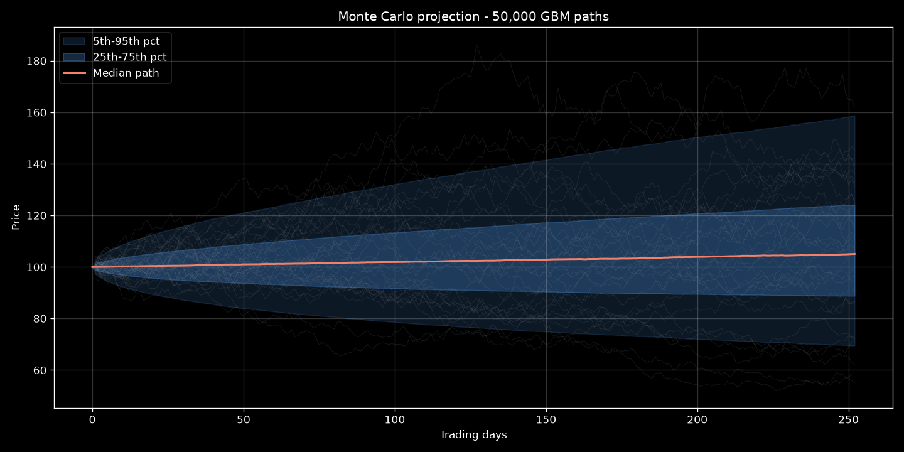
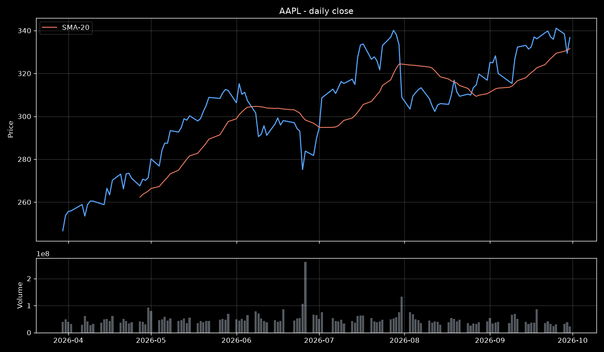

# quant-trading-models


## Objective

Quantitative research and algorithmic trading models in Python: Monte Carlo projections, strategy prototyping and financial analytics rendered in **dark mode**. The repository bridges an HPC mindset (vectorized, reproducible, benchmark-driven computation) with market applications.

## Architecture

```text
┌──────────────────┐    ┌───────────────────┐    ┌──────────────────┐
│  market data     │───▶│  src/ (models)    │───▶│  results/figures │
│  requests/APIs   │    │  numpy kernels    │    │  dark-mode PNGs  │
└──────────────────┘    │  pandas pipelines │    └──────────────────┘
                        └───────────────────┘
                                 ▲
                        ┌────────┴─────────┐
                        │ strategies/      │
                        │ signal research  │
                        └──────────────────┘
```

- **`src/`** — reusable, vectorized model kernels (GBM simulation, statistics, plotting).
- **`strategies/`** — signal research and strategy prototypes built on top of the kernels.
- **`results/figures/`** — generated dark-mode charts referenced by this README.

## Tech Stack

| Layer | Technology |
|---|---|
| Language | Python 3.11 |
| Computation | NumPy (vectorized Monte Carlo), pandas |
| Visualization | matplotlib (dark mode) |
| Data access | requests (market REST APIs) |
| CI | GitHub Actions (ruff lint + smoke run) |

## Repository Layout

```text
quant-trading-models/
├── src/
│   ├── __init__.py
│   ├── monte_carlo.py        # GBM projection, percentile bands, dark-mode chart
│   └── data_ingestion.py     # market data fetcher (REST) + dark-mode close/volume charts
├── strategies/               # signal research (roadmap)
├── results/figures/          # generated charts
├── requirements.txt
└── .github/workflows/ci.yml
```

## Execution

### Setup

```bash
python -m venv .venv
source .venv/bin/activate      # Windows: .venv\Scripts\activate
pip install -r requirements.txt
```

### Monte Carlo projection

```bash
python -m src.monte_carlo --ticker IBE.MC --s0 32.5 --mu 0.07 --sigma 0.22 --paths 100000
# expected_terminal=34.82
# median_terminal=34.71
# p05_terminal=25.63
# p95_terminal=46.99
# figure=results/figures/projection.png
```

### Market data ingestion

Fetch daily OHLCV bars from public market REST APIs and render dark-mode close/volume charts with an SMA-20 overlay:

```bash
python -m src.data_ingestion --symbol AAPL --period 6mo
python -m src.data_ingestion --symbol IBE.MC --period 1y --output results/figures/ibe_close.png
# symbol=AAPL bars=128
# first=2026-03-30 last=2026-09-30
# last_close=336.71 annualized_vol=27.89%
# figure=results/figures/aapl_close.png
```

### Lint and smoke test

```bash
pip install ruff
ruff check .
python -m src.monte_carlo --paths 500 --horizon 30 --output results/figures/smoke.png
```

## Results

Monte Carlo projection of a sample asset (S0=100, μ=8%, σ=25%, 252 trading days, 10⁵ paths):



| Statistic | Value |
|---|---:|
| Expected terminal price | TBD |
| Median terminal price (P50) | TBD |
| 5th percentile (P05) | TBD |
| 95th percentile (P95) | TBD |

> Figures and statistics are populated as runs complete; the smoke figure above is regenerated on every commit.

### Market data (AAPL, 6 months, daily bars)



| Metric | Value |
|---|---:|
| Bars ingested | 128 |
| Last close | 336.71 |
| Annualized volatility (log returns) | 27.89% |

> Values are from the run dated 2026-09-30; regenerate with the commands above.

## Roadmap

- [x] Historical data ingestion via `requests` (public market REST APIs)
- [ ] Strategy backtesting engine (pandas-based, event-driven)
- [ ] Portfolio risk metrics: VaR, CVaR, max drawdown
- [ ] Option pricing: Black-Scholes vs. Monte Carlo comparison
- [ ] HPC bridge: run large-path simulations on CESGA FinisTerrae-3

## License

[MIT](LICENSE) — Matias Gonzalez
